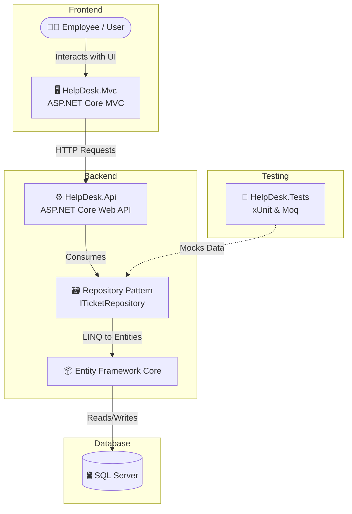

# 🎫 Help Desk Ticket Management System


A complete **Help Desk Ticket Management System** designed to handle support requests efficiently. This project includes a decoupled architecture using a RESTful Web API for backend services, an MVC application for the frontend, and comprehensive unit tests.

---

## 🏗️ System Architecture

The application follows a clean, decoupled architecture where the frontend MVC application communicates exclusively with the backend via HTTP.



---

## ✨ Features

- **📊 Dynamic Dashboard:** View real-time statistics including Total, Open, and Closed tickets.
- **📝 Raise Tickets:** Easily create new support tickets with a Title, Description, and Priority (Low, Medium, High).
- **🏷️ Status Tracking:** Tickets start as `Open` and can be transitioned to `In Progress` or `Closed`.
- **🔍 Filter & Search:** Filter the list of tickets dynamically by their current status.
- **✏️ Manage Tickets:** Edit ticket details or delete tickets that are no longer relevant.
- **🛡️ Decoupled Design:** Direct database access is restricted; the MVC application communicates entirely through a secure API service layer.

---

## 🛠️ Technology Stack

| Component | Technology Used |
|-----------|-----------------|
| **Backend Framework** | ASP.NET Core Web API (.NET 8.0) |
| **Frontend Framework** | ASP.NET Core MVC |
| **Database** | SQL Server LocalDB |
| **ORM** | Entity Framework Core (Code-First) |
| **Design Pattern** | Repository Pattern, Dependency Injection |
| **Testing** | xUnit, Moq |

---

## 🚀 How to Run Locally

### Prerequisites
- [.NET 8.0 SDK](https://dotnet.microsoft.com/download)
- SQL Server (or SQL Server Express LocalDB)

### Steps

1. **Clone the repository:**
   ```bash
   git clone https://github.com/mishtee-khanna/Help-Desk-Ticket-Management-System.git
   cd Help-Desk-Ticket-Management-System
   ```

2. **Update the Database:**
   Navigate to the API project and run the Entity Framework migrations to generate the database schema:
   ```bash
   cd HelpDesk.Api
   dotnet ef database update
   cd ..
   ```

3. **Run the Application:**
   You will need to run both the API and MVC projects simultaneously. 
   If using Visual Studio, configure **Multiple Startup Projects** and set both `HelpDesk.Api` and `HelpDesk.Mvc` to **Start**.

   Alternatively, using terminal:
   - **Terminal 1:** `dotnet run --project HelpDesk.Api`
   - **Terminal 2:** `dotnet run --project HelpDesk.Mvc`

---

## 🧪 Unit Testing

The `HelpDesk.Tests` project ensures reliability for the core API controller logic. It utilizes **xUnit** and **Moq** to completely mock the database repository layer, allowing tests to run instantly without a SQL Server connection.

**Mandatory Test Cases Implemented:**
- `GetAllTickets_ReturnsOkResult_WhenTicketsExist`
- `GetTicketById_ReturnsOkResult_WhenTicketExists`
- `GetTicketById_ReturnsNotFound_WhenTicketDoesNotExist`
- `CreateTicket_ReturnsOkResult_WhenTicketIsCreatedSuccessfully`
- `CreateTicket_ReturnsBadRequest_WhenTicketIsNull`
- `GetTicketsByStatus_ReturnsOkResult_WhenMatchingTicketExist`

Run tests using:
```bash
dotnet test
```
